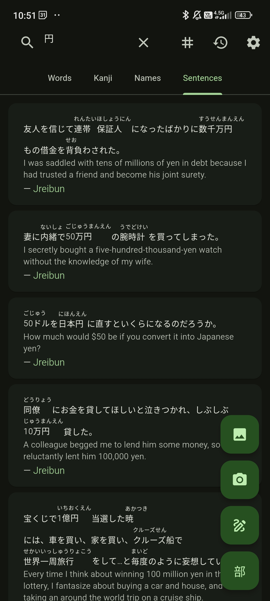
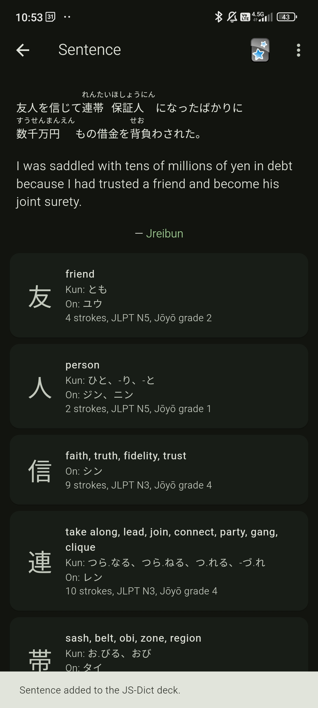
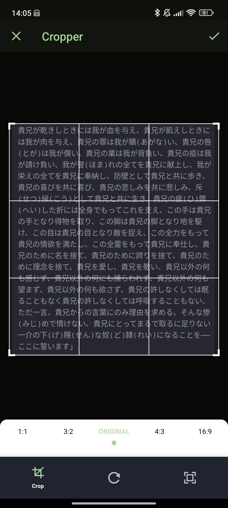

# **JS-Dict**

Japanese-English dictionary app powered by Jisho.org.

## OCR

Download and place the necessary models in `assets/tessdata/`, and build using the `ocr` flavor.

Files:
- https://github.com/tesseract-ocr/tessdata/blob/main/jpn.traineddata
- https://github.com/tesseract-ocr/tessdata/blob/main/jpn_vert.traineddata

## Screenshots

## License

JS-Dict is Free Software: You can use, study, share, and improve it at will. Specifically you can redistribute and/or modify it under the terms of the [GNU General Public License version 3](https://www.gnu.org/licenses/gpl-3.0.en.html) as published by the Free Software Foundation.
